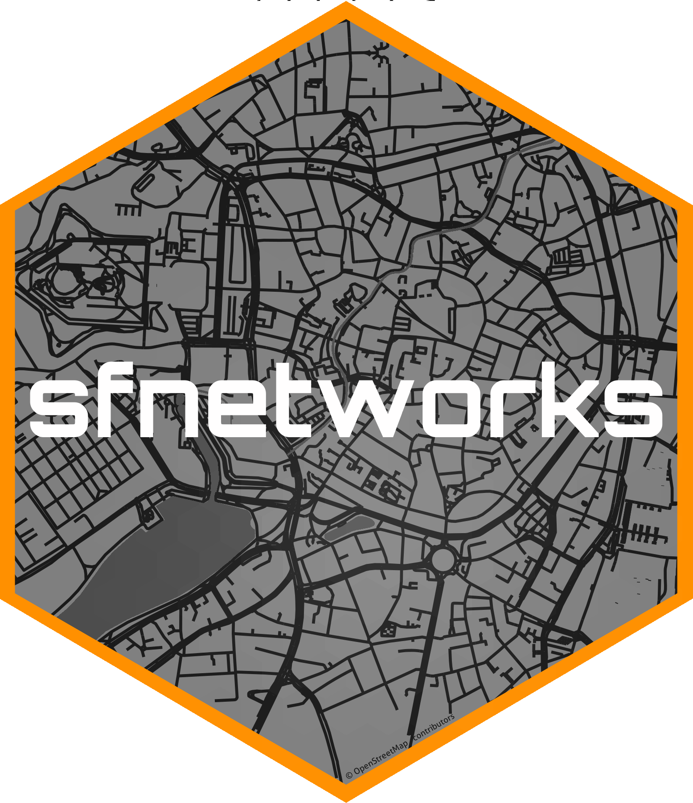

# Tidy Geospatial Networks in R 

<!-- badges: start -->

[](https://github.com/luukvdmeer/sfnetworks/actions)
[](https://app.codecov.io/gh/luukvdmeer/sfnetworks)
[](https://cran.r-project.org/package=sfnetworks)
[](https://cran.r-project.org/package=sfnetworks)

<!-- badges: end -->

{sfnetworks} is an R package for analysis of geospatial networks. It connects and extends the functionalities of the {tidygraph} package for network analysis and the {sf} package for spatial data science.

**NOTE: A new version of {sfnetworks} is currently in active development. The main branch of the GitHub repository contains the code for the development version, which will be soon released as v1.0. The currently released version on CRAN is v0.6.5. See [here](https://github.com/luukvdmeer/sfnetworks/tree/v0.6.5) for the source code of that version. The documentation website https://luukvdmeer.github.io/sfnetworks/ is for the CRAN release. For the documentation of the development version, see [here](https://luukvdmeer.github.io/sfnetworks/dev).**

## Background

Geospatial networks are graphs embedded in geographical space. That means that both the nodes and edges in the graph can be represented as geographic features: the nodes most commonly as points, and the edges as linestrings. They play an important role in many different domains, ranging from transportation planning and logistics to ecology and epidemiology. The structure and characteristics of geospatial networks go beyond standard graph topology, and therefore it is crucial to explicitly take space into account when analyzing them.

We created {sfnetworks} to facilitate such an integrated workflow. It combines the forces of two popular R packages: {[sf](https://r-spatial.github.io/sf/)} for spatial data science and {[tidygraph](https://tidygraph.data-imaginist.com/index.html)} for standard graph analysis. The core of the package is a dedicated data structure for geospatial networks, that can be provided as input to both the graph analytical functions of {tidygraph} as well as the spatial analytical functions of {sf}, without the need for conversion. Additionally, we implemented a set of geospatial network specific functions, such as routines for shortest path calculation, network cleaning and topology modification. {sfnetworks} is designed as a general-purpose package suitable for usage across different application domains, and can be seamlessly integrated in [tidyverse](https://www.tidyverse.org/) workflows.

<picture>
  <source media="(prefers-color-scheme: dark)" srcset="https://raw.githubusercontent.com/luukvdmeer/sfnetworks/refs/heads/main/vignettes/figures/dependencies-dark.png">
  <source media="(prefers-color-scheme: light)" srcset="https://raw.githubusercontent.com/luukvdmeer/sfnetworks/refs/heads/main/vignettes/figures/dependencies.png">
  
</picture>

## Installation

You can install the latest stable version of {sfnetworks} from [CRAN](https://cran.r-project.org/package=sfnetworks) with:

```r
install.packages("sfnetworks")
```

You can install the development version from [GitHub](https://github.com/luukvdmeer/sfnetworks) with:

```r
remotes::install_github("luukvdmeer/sfnetworks")
```

**Note:** Two important dependencies of {sfnetworks}, the {sf} package for spatial data science and the {igraph} package for network analysis (which is the main "analysis backend" of {tidygraph}), require some low-level software libraries to be installed on your system. Depending on which operating system you use, this can mean that you have to install these system requirements first, before you can install {sfnetworks}. See the installation guides of [sf](https://github.com/r-spatial/sf#installing) and [igraph](https://github.com/igraph/rigraph#installation) for details.

## Usage

To get started with {sfnetworks}, read the [Introduction to sfnetworks](https://luukvdmeer.github.io/sfnetworks/articles/sfn01_intro.html). Four additional package vignettes guide you in more detail through the functionalities of the package:

- [Creating and representing spatial networks](https://luukvdmeer.github.io/sfnetworks/articles/sfn02_create_represent.html)
- [Cleaning spatial networks](https://luukvdmeer.github.io/sfnetworks/articles/sfn03_cleaning.html)
- [Spatial joins and filters](https://luukvdmeer.github.io/sfnetworks/articles/sfn04_join_filter.html)
- [Routing on spatial networks](https://luukvdmeer.github.io/sfnetworks/articles/sfn05_routing.html)

## Contribution

We look very much forward to contributions to the package. See the [contributing guide](https://github.com/luukvdmeer/sfnetworks/blob/master/CONTRIBUTING.md) for further details.

This project is released with a [Contributor Code of Conduct](https://github.com/luukvdmeer/sfnetworks/blob/master/CODE_OF_CONDUCT.md). By participating in this project you agree to abide by its terms.

## Acknowledgment

This project gratefully acknowledges financial [support](https://www.r-consortium.org/projects) from the

<a href="https://www.r-consortium.org/all-projects/awarded-projects">

</a>
