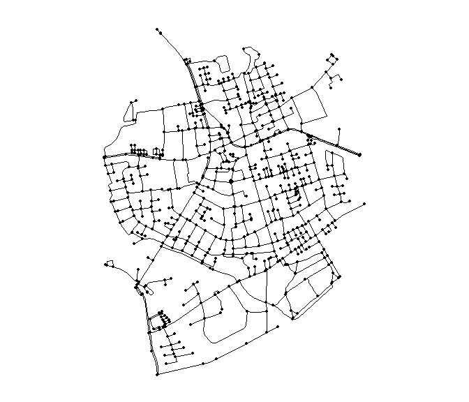
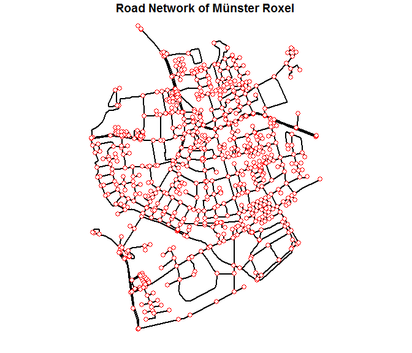
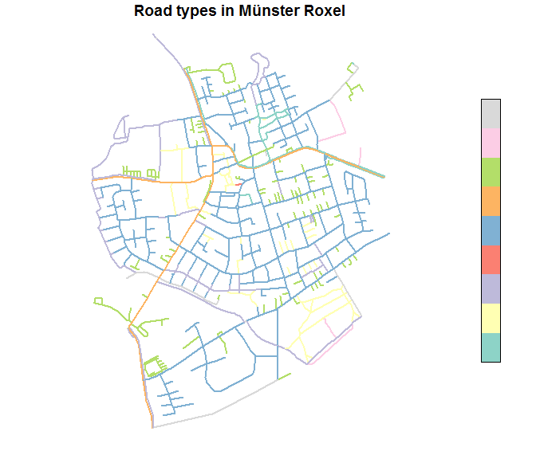
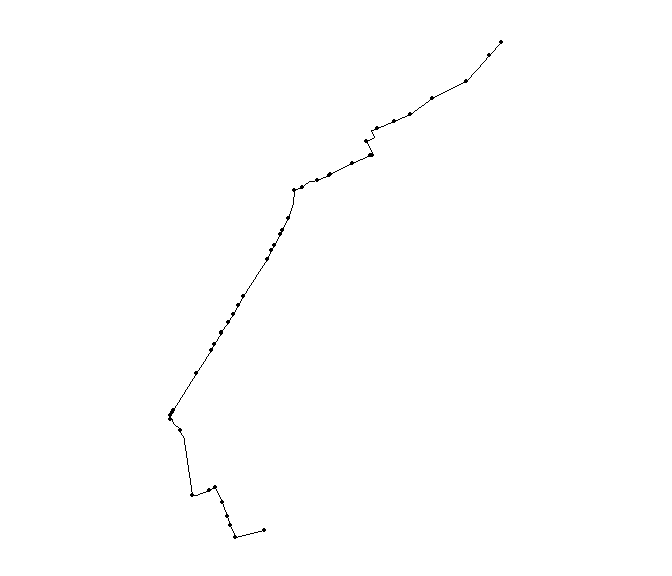
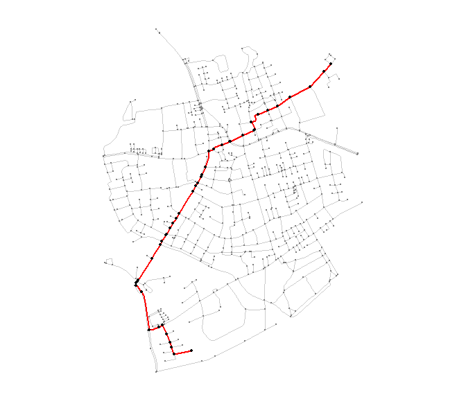

Introducing the package `sfnetworks`
================
Luuk van der Meer

This vignette introduces `sfnetworks`, an R package for creating, analyzing and visualizing spatial networks. The package can be seen as the connecting edge between the package [`sf`](https://cran.r-project.org/web/packages/sf/index.html), focused on analyzing spatial vector data, and the package [`igraph`](https://cran.r-project.org/web/packages/igraph/index.html), which is the R implementation of the igraph library, focused on analyzing graph structures. The functionalities `sfnetworks` make use of several functions from these two packages. Furhtermore, the package enables to convert sf objects to igraph objects.

The vignette has four chapters:

-   [1. Creating spatial networks](#ch1)
-   [2. Analyzing spatial networks](#ch2)
-   [3. Visualizing spatial networks](#ch3)
-   [4. Future work](#ch4)

1. Creating spatial networks
----------------------------

Spatial networks can be created using the function `sfn_asnetwork`, which is a generic function with S3 methods for a handful of classes. The returned value is always an object of class `sfn_network`.

### The `sfn_network` class

The `sfn_network` class is a S3 class for spatial networks. An object of class `sfn_network` is a list with two elements:

-   *The edges element:* an sf object with linestring geometry, representing the edges of the spatial network
-   *The nodes element:* an sf object with point geometry, representing the nodes of the spatial network

The edges element always has five core columns:

-   *EdgeID:* a unique identification number for each edge
-   *nodeID\_source:* the unique identification number of the source node of each edge
-   *nodeID\_target:* the unique identification number of the target node of each edge
-   *length:* the length of each edge in meters
-   *geometry:* the sf geometry list column

Besides the core columns, the edges element can have additional attribute columns (e.g. streetname, maximum speed, et cetera), which are copied from the input data.

The nodes element always has two core columns:

-   *nodeID:* the unique identification number of each node
-   *geometry:* the sf geometry list column

### Method for objects of class `sf`

The `sfn_asnetwork.sf` method converts objects of class `sf` with a linestring geometry to objects of class `sfn_network`. The lines of the inputted object form the edges of the network. The nodes are the startpoints and endpoints of the lines. In networks, startpoints and/or endpoints are usually shared by two or more lines. These shared points will be one single node in the nodes element of the `sfn_network` object.

Let's show an example using the `roxel` dataset, which is an sf object representing the road network of the Roxel neighborhood in Münster, Germany. This dataset is attached as LazyData to the `sfnetworks` package, and can be loaded as follows.

``` r
# Loading the sfnetworks package
library(sfnetworks)

# Loading the tidyverse package
# To use for coding inside the vignette
library(tidyverse)

# Loading the roxel dataset
roxel
```

    ## Simple feature collection with 851 features and 2 fields
    ## geometry type:  LINESTRING
    ## dimension:      XY
    ## bbox:           xmin: 7.522594 ymin: 51.94151 xmax: 7.546705 ymax: 51.9612
    ## epsg (SRID):    4326
    ## proj4string:    +proj=longlat +datum=WGS84 +no_defs
    ## First 10 features:
    ##                     name        type                       geometry
    ## 1    Havixbecker Strasse residential LINESTRING (7.533722 51.955...
    ## 2           Pienersallee   secondary LINESTRING (7.532442 51.954...
    ## 3  Schulte-Bernd-Strasse residential LINESTRING (7.532709 51.952...
    ## 4                   <NA>        path LINESTRING (7.540063 51.944...
    ## 5           Welsingheide residential LINESTRING (7.537673 51.947...
    ## 6                   <NA>     footway LINESTRING (7.543791 51.947...
    ## 7                   <NA>     footway LINESTRING (7.54012 51.9447...
    ## 8                   <NA>        path LINESTRING (7.53822 51.9454...
    ## 9                   <NA>       track LINESTRING (7.540063 51.944...
    ## 10                  <NA>       track LINESTRING (7.5424 51.94599...

The sf object - with linestring geometry - can then be converted to a spatial network of class `sfn_network`.

``` r
# Convert sf object to sfn_network object
sfn_asnetwork(roxel)
```

    ## A spatial network with 851 edges and 701 nodes 
    ## 
    ## --> Edges element; an sf object with linestring geometry
    ## Simple feature collection with 851 features and 6 fields
    ## geometry type:  LINESTRING
    ## dimension:      XY
    ## bbox:           xmin: 7.522594 ymin: 51.94151 xmax: 7.546705 ymax: 51.9612
    ## epsg (SRID):    4326
    ## proj4string:    +proj=longlat +datum=WGS84 +no_defs
    ## First 5 features:
    ##                    name        type edgeID nodeID_source nodeID_target
    ## 1   Havixbecker Strasse residential      1           316           305
    ## 2          Pienersallee   secondary      2           279           263
    ## 3 Schulte-Bernd-Strasse residential      3           283           287
    ## 4                  <NA>        path      4           568           489
    ## 5          Welsingheide residential      5           463           455
    ##          length                       geometry
    ## 1  28.85976 [m] LINESTRING (7.533722 51.955...
    ## 2 107.70459 [m] LINESTRING (7.532442 51.954...
    ## 3  54.36237 [m] LINESTRING (7.532709 51.952...
    ## 4 155.23052 [m] LINESTRING (7.540063 51.944...
    ## 5 208.66369 [m] LINESTRING (7.537673 51.947...
    ## 
    ## --> Nodes element; an sf object with point geometry
    ## Simple feature collection with 701 features and 1 field
    ## geometry type:  POINT
    ## dimension:      XY
    ## bbox:           xmin: 7.522622 ymin: 51.94151 xmax: 7.546705 ymax: 51.9612
    ## epsg (SRID):    4326
    ## proj4string:    +proj=longlat +datum=WGS84 +no_defs
    ## First 5 features:
    ##   nodeID                  geometry
    ## 1    316 POINT (7.533722 51.95556)
    ## 2    305 POINT (7.533461 51.95576)
    ## 3    279 POINT (7.532442 51.95422)
    ## 4    263  POINT (7.53209 51.95328)
    ## 5    283 POINT (7.532709 51.95209)

### Method for objects of class `osmdata`

One who says 'mapping' and 'open source', automatically says 'OpenStreetMap'. The project allows free access to their map and all of the underlying map data, and is therefore extremly popular by those who analyze spatial data. The R implementation of automatically downloading and importingOpenStreetMap data is the package [`osmdata`](https://cran.r-project.org/web/packages/osmdata/index.html). Using this package, a user can download the OpenStreetMap data for an area inside a given bounding box, and also query for a specific type of data. Road infrastructure in OpenStreetMap has the tag `highway`. When working with spatial road networks, this is the data of interest.

Let's show an example of importing a road network with the `osmdata` package, using a bounding box for the neighborhood of Handorf in Münster, Germany, and then converting it to an spatial network of class `sfn_network` with the `sfnetworks` package.

``` r
# Load the osmdata package
library(osmdata)
```

    ## Data (c) OpenStreetMap contributors, ODbL 1.0. http://www.openstreetmap.org/copyright

``` r
# Define the bounding box for Handorf
handorf_bbox = c(7.696474, 51.9816336, 7.7100898, 51.994452)

# Download and import the OpenStreetMap data
handorf = opq(bbox = handorf_bbox) %>%
  add_osm_feature(key = 'highway') %>%
  osmdata_sf()

handorf
```

    ## Object of class 'osmdata' with:
    ##                  $bbox : 51.9816336,7.696474,51.994452,7.7100898
    ##         $overpass_call : The call submitted to the overpass API
    ##                  $meta : metadata including timestamp and version numbers
    ##            $osm_points : 'sf' Simple Features Collection with 1238 points
    ##             $osm_lines : 'sf' Simple Features Collection with 285 linestrings
    ##          $osm_polygons : 'sf' Simple Features Collection with 2 polygons
    ##        $osm_multilines : 'sf' Simple Features Collection with 0 multilinestrings
    ##     $osm_multipolygons : 'sf' Simple Features Collection with 0 multipolygons

As can be seen, the data comes as an object of class `osmdata`, which is a list containing several sf objects with different geometry types. The point geometries with the `highway` tag in OpenStreetMap are things like bus stops, zebra crossings, lampposts, stop signs, speed bumps, et cetera. In other words, they are not roads, neither road intersections. That is, they will not be included in the spatial network of class `sfn_network`. The sf object with the line geometry are all roads and pathes, and will form the edges element in the `sfn_network` object.However, squares, roundabouts and roads that have the same start as endpoint, are often stored as polygons. The `sfn_asnetwork.osmdata` method therefore first transforms the polygons of the `osmdata` object into lines, then exracts all the lines as an sf object with line geometry, and converts that to spatial network of class `sfn_network`.

``` r
# Convert osmdata object to sfn_network object
sfn_asnetwork(handorf)
```

    ## A spatial network with 287 edges and 466 nodes 
    ## 
    ## --> Edges element; an sf object with linestring geometry
    ## Simple feature collection with 287 features and 37 fields
    ## geometry type:  LINESTRING
    ## dimension:      XY
    ## bbox:           xmin: 7.692907 ymin: 51.98082 xmax: 7.716578 ymax: 51.99502
    ## epsg (SRID):    4326
    ## proj4string:    +proj=longlat +datum=WGS84 +no_defs
    ## First 5 features:
    ##     osm_id              name access area bicycle bridge created_by
    ## 1  4863860    Dorbaumstraße   <NA> <NA>    <NA>   <NA>       <NA>
    ## 2  4863864 Handorfer Straße   <NA> <NA>    <NA>   <NA>       <NA>
    ## 3 23373682    Dorbaumstraße   <NA> <NA>    <NA>   <NA>       <NA>
    ## 4 23373691              <NA>   <NA> <NA>    <NA>   <NA>       JOSM
    ## 5 23373694    Kötterstraße   <NA> <NA>    <NA>   <NA>       <NA>
    ##   cycleway description foot  hgv     highway lanes lanes.backward
    ## 1     <NA>        <NA> <NA> <NA>    tertiary  <NA>           <NA>
    ## 2     <NA>        <NA> <NA> <NA>    tertiary  <NA>           <NA>
    ## 3     <NA>        <NA> <NA> <NA>    tertiary  <NA>           <NA>
    ## 4     <NA>        <NA>  yes <NA>    cycleway  <NA>           <NA>
    ## 5     <NA>        <NA> <NA> <NA> residential  <NA>           <NA>
    ##   lanes.forward layer  lit maxspeed noexit oneway place_numbers  ref
    ## 1          <NA>  <NA> <NA>     <NA>   <NA>   <NA>          1-29 K 16
    ## 2          <NA>  <NA> <NA>     <NA>   <NA>   <NA>          1-49 K 16
    ## 3          <NA>  <NA> <NA>     <NA>   <NA>   <NA>           30- K 16
    ## 4          <NA>  <NA> <NA>     <NA>   <NA>   <NA>          <NA> <NA>
    ## 5          <NA>  <NA> <NA>     <NA>   <NA>   <NA>          1-63 <NA>
    ##   segregated service smoothness              source source.ref surface
    ## 1       <NA>    <NA>       <NA> survey: gps by bike       <NA>    <NA>
    ## 2       <NA>    <NA>       <NA>                <NA>       <NA>    <NA>
    ## 3       <NA>    <NA>       <NA> survey: gps by bike       <NA>    <NA>
    ## 4       <NA>    <NA>       <NA>                <NA>       <NA>    <NA>
    ## 5       <NA>    <NA>       <NA>                <NA>       <NA>    <NA>
    ##   tracktype tunnel turn.lanes.backward turn.lanes.forward width edgeID
    ## 1      <NA>   <NA>                <NA>               <NA>  <NA>      1
    ## 2      <NA>   <NA>                <NA>               <NA>  <NA>      2
    ## 3      <NA>   <NA>                <NA>               <NA>  <NA>      3
    ## 4      <NA>   <NA>                <NA>               <NA>  <NA>      4
    ## 5      <NA>   <NA>                <NA>               <NA>  <NA>      5
    ##   nodeID_source nodeID_target        length                       geometry
    ## 1            76           200 360.44650 [m] LINESTRING (7.698971 51.988...
    ## 2            76            65 179.47556 [m] LINESTRING (7.698971 51.988...
    ## 3           200           463 773.02914 [m] LINESTRING (7.702385 51.991...
    ## 4           199           200   4.73605 [m] LINESTRING (7.702332 51.991...
    ## 5           188           306 298.13865 [m] LINESTRING (7.701638 51.985...
    ## 
    ## --> Nodes element; an sf object with point geometry
    ## Simple feature collection with 466 features and 1 field
    ## geometry type:  POINT
    ## dimension:      XY
    ## bbox:           xmin: 7.692907 ymin: 51.9812 xmax: 7.716578 ymax: 51.99477
    ## epsg (SRID):    4326
    ## proj4string:    +proj=longlat +datum=WGS84 +no_defs
    ## First 5 features:
    ##   nodeID                  geometry
    ## 1     76 POINT (7.698971 51.98864)
    ## 2    200 POINT (7.702385 51.99106)
    ## 3     65 POINT (7.698562 51.98707)
    ## 4    463 POINT (7.711681 51.99474)
    ## 5    199 POINT (7.702332 51.99109)

OpenStreetMap data comes with a lot of attribute columns. For users who are not interested in these attributes, but only in the geometry of the network, the `sfn_asnetwork` function has a parameter `attributes`, which is by default set to `TRUE`, but can be changed to `FALSE`. If that is the case, all attribute columns from the input object will be dropped, and the resulting `sfn_network` object will only contain the core columns.

``` r
# Convert osmdata object to sfn_network, with attrbutes set to FALSE
sfn_asnetwork(handorf, attributes = FALSE)
```

    ## A spatial network with 287 edges and 466 nodes 
    ## 
    ## --> Edges element; an sf object with linestring geometry
    ## Simple feature collection with 287 features and 4 fields
    ## geometry type:  LINESTRING
    ## dimension:      XY
    ## bbox:           xmin: 7.692907 ymin: 51.98082 xmax: 7.716578 ymax: 51.99502
    ## epsg (SRID):    4326
    ## proj4string:    +proj=longlat +datum=WGS84 +no_defs
    ## First 5 features:
    ##   edgeID nodeID_source nodeID_target        length
    ## 1      1            76           200 360.44650 [m]
    ## 2      2            76            65 179.47556 [m]
    ## 3      3           200           463 773.02914 [m]
    ## 4      4           199           200   4.73605 [m]
    ## 5      5           188           306 298.13865 [m]
    ##                         geometry
    ## 1 LINESTRING (7.698971 51.988...
    ## 2 LINESTRING (7.698971 51.988...
    ## 3 LINESTRING (7.702385 51.991...
    ## 4 LINESTRING (7.702332 51.991...
    ## 5 LINESTRING (7.701638 51.985...
    ## 
    ## --> Nodes element; an sf object with point geometry
    ## Simple feature collection with 466 features and 1 field
    ## geometry type:  POINT
    ## dimension:      XY
    ## bbox:           xmin: 7.692907 ymin: 51.9812 xmax: 7.716578 ymax: 51.99477
    ## epsg (SRID):    4326
    ## proj4string:    +proj=longlat +datum=WGS84 +no_defs
    ## First 5 features:
    ##   nodeID                  geometry
    ## 1     76 POINT (7.698971 51.98864)
    ## 2    200 POINT (7.702385 51.99106)
    ## 3     65 POINT (7.698562 51.98707)
    ## 4    463 POINT (7.711681 51.99474)
    ## 5    199 POINT (7.702332 51.99109)

Important to note here that the quality of OpenStreetMap data is not always very high. It often happens that lines are not cut at intersections, lines don't touch when they should, et cetera. The best way is to manually fix these topology errors. However, in large networks this will be a very labour intensive operation. The `v.clean` (see [here](https://grass.osgeo.org/grass70/manuals/v.clean.html)) tool in GRASS GIS is then an alternative. It is highly recommended to first run this tool on the OpenStreetMap data before analysing it. This cleaning operation was also performed on the `roxel` dataset that is attached to this package.

### Other methods

Besides the methods for objects of class `sf` and objects of class `osmdata`, the `sfn_asnetwork` generic function also has a method for objects of class `SpatialLinesDataFrame`, which is the class for spatial data with linestring geometry in the `sp` package. Finally, there exists a method for objects of class `sfn_route`, which is a class in the `sfnetworks` package for routes in a spatial network. This class will be introduced later in this vignette.

2. Analyzing spatial networks
-----------------------------

The `sfnetworks` has a few built-in functions to analyze spatial networks. For further analysis, there is the possibility to convert the network of class `sfn_network` into a graph object of class `igraph`, after which the vast range of analytic functions from the `igraph` package can be used.

### Calculate shortest paths

With the function `sfn_shortestpath`, the shortest path between two nodes in a spatial network can be calculated. The function returns an object of class `sfn_route`, a S3 class specially designed for routes in a spatial network. A route is different from a network in the sense that the nodes and edges in a route have a specific order. In an object of class `sfn_route`, this order is defined in the route element. The route element consists of one feature that contains both the nodes and edges in a geometrycollection (class `sfc_GEOMETRYCOLLECTION`), in the right order. The features in the edges element and/or the nodes element can now be ordered in any way the user wants (e.g. from longest edge to shortest edge), without disturbing the right order of the route. Finally, an object of class `sfn_route` also contains a weights element, representing the total weight (i.e. sum of the edges weights) of the route.

To summarize, an object of class `sfn_route` is a list with four elements:

-   *The route element:* an sf object of one feature with a geometrycollection geometry, containing both the nodes and edges of the route, in the right order
-   *The edges element:* an sf object with linestring geometry, representing the edges of which the route is made up
-   *The nodes element:* an sf object with point geometry, representing the nodes of which the route is made up
-   *The weights element:* a value representing the total weight of the route (i.e. sum of the edges weights)

Just as in the class `sfn_network`, the edges elements has five core columns (edgeID, nodeID\_source, nodeID\_target, length and geometry), with optionally additional attributes columns. The nodes element has two core columns (nodeID, geometry).

As inputs, the `sfn_shortestpath` function takes the spatial network of class `sfn_network` (parameter `x`), the nodeID of the node where the shortest path should calculated from (parameter `start`) and the nodeID of the node where the shortest path should lead to (parameter `end`).

Additionally, the weight of each edge should be given (parameter `weights`). This can be done by specifying the name of the column in the edges element of the inputted `sfn_network` object which values should be used as edge weights. By default, the length column - one of the core columns of the edges element - is used for the edge weights. That mean that literally the shortest path is calculated. However, if someone for example has a column in their data with the duration of each edge, this column could be used for edge weights, and the fastest path is calculated. Another example could be a column with the average slope of each edge, which would lead to calculating the flattest path.

Let's show an example with the `roxel` dataset. Below, the shortest path between the node with nodeID 195 (in the southwest of Münster Roxel) and the node with nodeID 676 (in the northeast of Münster Roxel). For the weights, the default value ('length') will be used.

``` r
# Calculate the shortest path between node 195 and node 676
roxel %>% 
  sfn_asnetwork() %>% 
  sfn_shortestpath(start = 195, end = 676)
```

    ## A route with 43 edges and 44 nodes 
    ## 
    ## --> Route element; a sf geometrycollection
    ## Simple feature collection with 1 feature and 0 fields
    ## geometry type:  GEOMETRYCOLLECTION
    ## dimension:      XY
    ## bbox:           xmin: 7.525638 ymin: 51.94252 xmax: 7.543782 ymax: 51.95921
    ## epsg (SRID):    4326
    ## proj4string:    +proj=longlat +datum=WGS84 +no_defs
    ##                         geometry
    ## 1 GEOMETRYCOLLECTION (POINT (...
    ## 
    ## --> Edges element; an sf object with linestring geometry
    ## Simple feature collection with 43 features and 6 fields
    ## geometry type:  LINESTRING
    ## dimension:      XY
    ## bbox:           xmin: 7.525638 ymin: 51.94252 xmax: 7.543782 ymax: 51.95921
    ## epsg (SRID):    4326
    ## proj4string:    +proj=longlat +datum=WGS84 +no_defs
    ## First 5 features:
    ##                   name        type edgeID nodeID_source nodeID_target
    ## 1 Lise-Meitner-Strasse residential     87           159           195
    ## 2 Lise-Meitner-Strasse residential    550           152           159
    ## 3 Lise-Meitner-Strasse residential    549           146           152
    ## 4 Lise-Meitner-Strasse residential    552           139           146
    ## 5 Lise-Meitner-Strasse residential    551           124           139
    ##          length                       geometry
    ## 1 112.53259 [m] LINESTRING (7.529177 51.942...
    ## 2  46.89715 [m] LINESTRING (7.528951 51.942...
    ## 3  36.21925 [m] LINESTRING (7.528777 51.943...
    ## 4  54.09753 [m] LINESTRING (7.528463 51.943...
    ## 5  63.72230 [m] LINESTRING (7.528095 51.944...
    ## 
    ## --> Nodes element; an sf object with point geometry
    ## Simple feature collection with 44 features and 1 field
    ## geometry type:  POINT
    ## dimension:      XY
    ## bbox:           xmin: 7.52564 ymin: 51.94252 xmax: 7.543782 ymax: 51.95921
    ## epsg (SRID):    4326
    ## proj4string:    +proj=longlat +datum=WGS84 +no_defs
    ## First 5 features:
    ##   nodeID                  geometry
    ## 1    195 POINT (7.530772 51.94274)
    ## 2    159 POINT (7.529177 51.94252)
    ## 3    152 POINT (7.528951 51.94292)
    ## 4    146 POINT (7.528777 51.94322)
    ## 5    139 POINT (7.528463 51.94367)
    ## 
    ## --> Weight element; the total weight of the route
    ## 2744.92736183062

Instead of passing a column name to the `weights` parameter, it is also possible to give a numeric vector of the same length as the edges element in the inputted network. The values of this vector will then be used as weights. Furthermore, one can define if the network should be considered a directed network (parameter `directed`). That is, if each edge can only be travelled from source to target, and not in the opposite direction. By default, this is set to `FALSE`, meaning that each edge can be travelled in both directions.

Let's show another example, that may not make a lot of sense, but does show how the functions works. The parameter `weights` will now be a numeric vector of random numbers, and the parameter `directed` will be set to `TRUE`. Keep in mind that setting `directed` to `TRUE` while working with a network that is not designed as a directional network, like the `roxel` dataset, is never a good idea. Here, it is just done to show the functionalities of the `sfn_shortestpath` function.

``` r
# Create a vector with random numbers
# Length equal to the number of edges in the sfn_network
vec = roxel %>%
  sfn_asnetwork() %>%
  pluck('edges') %>%
  nrow() %>%
  runif()

head(vec)
```

    ## [1] 0.1714865 0.6957192 0.3483307 0.6528016 0.5031765 0.1419172

``` r
# Calculate the shortest path between node 90 and node 51, with directed to FALSE
roxel %>% 
  sfn_asnetwork() %>% 
  sfn_shortestpath(start = 90, end = 51, weights = vec, directed = TRUE)
```

    ## A route with 2 edges and 3 nodes 
    ## 
    ## --> Route element; a sf geometrycollection
    ## Simple feature collection with 1 feature and 0 fields
    ## geometry type:  GEOMETRYCOLLECTION
    ## dimension:      XY
    ## bbox:           xmin: 7.525749 ymin: 51.94671 xmax: 7.527087 ymax: 51.94805
    ## epsg (SRID):    4326
    ## proj4string:    +proj=longlat +datum=WGS84 +no_defs
    ##                         geometry
    ## 1 GEOMETRYCOLLECTION (POINT (...
    ## 
    ## --> Edges element; an sf object with linestring geometry
    ## Simple feature collection with 2 features and 6 fields
    ## geometry type:  LINESTRING
    ## dimension:      XY
    ## bbox:           xmin: 7.525749 ymin: 51.94671 xmax: 7.527087 ymax: 51.94805
    ## epsg (SRID):    4326
    ## proj4string:    +proj=longlat +datum=WGS84 +no_defs
    ##           name      type edgeID nodeID_source nodeID_target         length
    ## 1 Pienersallee secondary    830            90            56 165.271693 [m]
    ## 2 Pienersallee secondary    831            56            51   9.464045 [m]
    ##                         geometry
    ## 1 LINESTRING (7.527087 51.948...
    ## 2 LINESTRING (7.525816 51.946...
    ## 
    ## --> Nodes element; an sf object with point geometry
    ## Simple feature collection with 3 features and 1 field
    ## geometry type:  POINT
    ## dimension:      XY
    ## bbox:           xmin: 7.525749 ymin: 51.94671 xmax: 7.527087 ymax: 51.94805
    ## epsg (SRID):    4326
    ## proj4string:    +proj=longlat +datum=WGS84 +no_defs
    ##   nodeID                  geometry
    ## 1     90 POINT (7.527087 51.94805)
    ## 2     56 POINT (7.525816 51.94679)
    ## 3     51 POINT (7.525749 51.94671)
    ## 
    ## --> Weight element; the total weight of the route
    ## 0.549560378538445

### Total length of a network or route

The function `sfn_length` is a generic function with S3 methods for objects of class `sfn_network` or class `sfn_route`. It uses the `st_length` function from the `sf` package to calculate the total length of respectively a spatial network or a route in a spatial network.

``` r
# Calculate the total length of a spatial network
roxel %>%
  sfn_asnetwork() %>%
  sfn_length()
```

    ## 50522.78 [m]

``` r
# Calculate the total length of a route in a spatial network
roxel %>%
  sfn_asnetwork() %>%
  sfn_shortestpath(start = 195, end = 676) %>%
  sfn_length()
```

    ## 2744.927 [m]

### Transform or convert the CRS of a network or route

The function `sfn_length` is a generic function with S3 methods for objects of class `sfn_network` or class `sfn_route`. It uses the `st_transform` function from the `sf` package to transform or convert the coordinate reference system of a spatial network or a route in a spatial network. When doing this, the `st_transform` function is applied to all the geographic elements of the input object (`nodes` and `edges` for an `sfn_network` object and `route`, `nodes` and `edges` for an `sfn_route` object).

``` r
# Original sfn_network
roxel %>%
  sfn_asnetwork() %>%
  summary()
```

    ##                  value
    ## Number of edges    851
    ## Number of nodes    701
    ## Total length (m) 50523
    ## CRS EPSG          4326

``` r
# Transform from WGS84 (EPSG 4326) to Gauss-Kruger Zone 2 (EPSG 31466)
roxel %>%
  sfn_asnetwork() %>%
  sfn_transform(crs = 31466) %>%
  summary()
```

    ##                  value
    ## Number of edges    851
    ## Number of nodes    701
    ## Total length (m) 50530
    ## CRS EPSG         31466

### Convert to `igraph` object

The function `sfn_network2graph` converts a spatial network of class `sfn_network` to a graph object of class `igraph`. After this conversion, one can apply the wide range of functions for graph analysis from the `igraph` package. When converting to an `igraph` object, the geometry of the edges and nodes is not preserved. The resulting graph is simply a set of weighted connections between unlocated nodes. By default, this weights are the lengths of the edges. However, just as in the `sfn_shortestpath` function - that actually uses a conversion to a graph inside the function -, the user can set any column from the edges element as weight column, or give a numeric vector of the same length as the edges element.

``` r
# Convert sfn_network to igraph object
roxel %>%
  sfn_asnetwork() %>%
  sfn_network2graph()
```

    ## IGRAPH 29806c5 UNW- 701 851 -- 
    ## + attr: name (v/c), weight (e/n)
    ## + edges from 29806c5 (vertex names):
    ##  [1] 316--305 279--263 283--287 568--489 463--455 677--674 572--562
    ##  [8] 489--455 568--670 646--615 364--369 357--356 361--332 681--701
    ## [15] 273--303 512--565 561--531 183--169 206--188 262--219 290--274
    ## [22] 322--319 205--241 418--432 432--378 611--632 628--643 673--694
    ## [29] 352--365 314--281 81 --87  7  --13  86 --62  218--270 596--617
    ## [36] 112--233 32 --57  37 --18  14 --16  24 --12  21 --8   19 --15 
    ## [43] 10 --4   18 --17  16 --26  12 --9   89 --106 85 --99  58 --77 
    ## [50] 117--141 163--157 398--396 411--425 233--235 194--202 172--178
    ## + ... omitted several edges

Let's show some examples of measures that can now be calculated with the `igraph` package. For a full description of the functions in this package, please see its [website](http://igraph.org/r/).

``` r
# Load the igraph package
library(igraph)

# Create the graph
g = roxel %>%
  sfn_asnetwork() %>%
  sfn_network2graph()

# Calculate network diameter
# This is the longest shortest path between two nodes in the network
igraph::diameter(g, directed = FALSE)
```

    ## [1] 2876.518

``` r
# Calculate the degree centrality of the nodes
# This is the number of edges that a specific node has
# Show only the first 6 results
igraph::degree(g, v = V(g), mode = 'all') %>% head()
```

    ## 316 305 279 263 283 287 
    ##   4   3   4   3   3   4

``` r
# Calculate the betweenness centrality of the nodes
# This is the number of shortest paths that pass through a node
# Show only the first 6 results
igraph::betweenness(g, v = V(g), directed = FALSE) %>% head()
```

    ##   316   305   279   263   283   287 
    ## 13809  9777 35240 31745  7174  9081

3. Visualization of a spatial network
-------------------------------------

The `sfnetworks` package contains plot methods for both of its classes (i.e. class `sfn_network` and class `sfn_route`).

### Plot method for class `sfn_network`

The plot method for objects of class `sfn_network` plots the geometry of the edges with `plot.sf` and adds the geometry of the nodes on top of it.

``` r
# Plot sfn_network
roxel %>%
  sfn_asnetwork() %>%
  plot()
```



The user can change several parameters regarding the layout of the plot, for example the color in which the edges are plot, the linewidth of the edges, the color in which the nodes are plot and the symbol type and size of the nodes. Additional parameters are passed on to the plot function for `sf` objects.

``` r
# Plot sfn_network in different style
roxel %>%
  sfn_asnetwork() %>%
  plot(
    col_edges = 'black',
    lwd = 2,
    col_nodes = 'red',
    pch = 21,
    cex = 1.1,
    main = "Road Network of Münster Roxel"
  ) 
```



It is also possible to color the edges by an attribute from the edges element of the network. To do so, the name of the column needs to be assigned to the `attribute` parameter. Then, only the edges element will be plotted, as an `sf` object with one attribute column.

``` r
# Plot sfn_network colored by attribute
roxel %>%
  sfn_asnetwork() %>%
  plot(
    lwd = 2,
    attribute = 'type',
    pal = rainbow,
    key.size = lcm(3.5),
    main = "Road types in Münster Roxel"
  )
```

    ## Warning in title(...): "key.size" is not a graphical parameter

    ## Warning in title(...): "add" is not a graphical parameter

    ## Warning in title(...): "key.size" is not a graphical parameter



### Plot method for class `sfn_route`

The plot method for objects of class `sfn_route` plots the geometry of the edges with `plot.sf` and adds the geometry of the nodes on top of it.

``` r
# Plot sfn_route
roxel %>%
  sfn_asnetwork() %>%
  sfn_shortestpath(start = 195, end = 676) %>%
  plot()
```



This is not very informative though. Therefore, the plot methods for objects of class `sfn_route` has the parameter `network`. By default it is set to `NULL`, but the user can assign it the spatial network of class `sfn_network` on which the shortest path is created. Then, the network will be plotted in grayscale on the background.

``` r
# Plot sfn_route with network on background
roxel %>%
  sfn_asnetwork() %>%
  sfn_shortestpath(start = 195, end = 676) %>%
  plot(
    col_edges = "Red",
    lwd = 2,
    network = roxel %>% sfn_asnetwork()
  )
```



4. Future work
--------------

The package `sfnetworks` as presented in this vignette is still in development. The following functionalities are planned to be added to the package:

-   Add a column specifying the direction of each edge to the edges element of an object of class `sfn_network`. This could for example be values of 1 for an edge that can only be travelled from startpoint to endpoint, -1 for an edge that can only be travelled from endpoint to startpoint, and 0 for an edge that can be travelled in both ways. The user can assign this direction values to each edge. In the case of an `osmdata` object as input, lines with a `oneway` label will be assigned a value of 1 for direction automatically.
-   Give the option to not only assign weights to edges, but also to nodes. For example, when calculating shortest paths based on travel time, he may have information about average waiting time on a crossing. This information can then be added as weights to the nodes, and taken into account when calculating shortest paths.
-   Give the option to calculate shortest paths from one node to several other nodes. Now, it is only possible to calculate shortest paths between two nodes at a time.
-   Import the v.clean function for cleaning vector topology from GRASS GIS, making use of the `rgrass7` package, the bridge between R and GRASS GIS.
-   Enable users to not only calculate clusters of nodes based on betweenness centrality (which can already be done after converting the `sfn_network` object to an `igraph` object) but also visualize them (which can not be done yet since the converted `igraph` object has no geometry).
